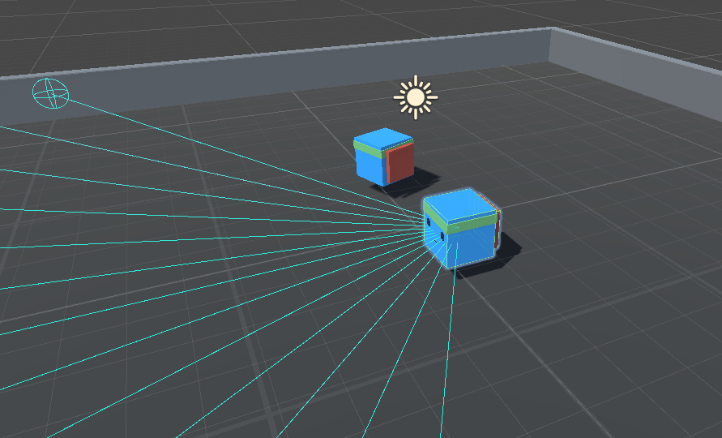
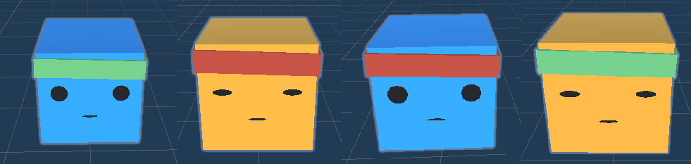

# RLearning project
A project developed in Unity using ML-Agents. The assets are sourced from sample use cases of ML-Agents.

## Touch Back
The goal of the game is to touch the opponent's back without getting touched in return. The game is played in a small arena. Agents can recognize walls, the opponent, and the opponent's back.

### Strategies
Agents are categorized based on their strategy and are trained using the same parameters with the PPO algorithm. There are two primary strategies:

- FOCUS: The agent is punished if it is not facing the opponent.
- DISTANCE: The agent is punished when it is too far from the opponent.
Given the combinations of these strategies, there are a total of 4 distinct agent types.

### Selfplay
Training consists of two phases. In the first phase, agents play against themselves. In the second phase, they compete on multiple arenas against their previous versions, other agent types, and the previous versions of those agents. Opponents are selected at random.

### Scoring
Given that cumulative rewards are not the primary focus during Selfplay, three key measures are collected during training:

- ELO: Commonly used in selfplay, this measure allows for comparison between agents.
- Focus: Measures the frequency with which an agent faces its opponent across episodes.
- Distance: Measures the average distance between the agent and its opponent across episodes.
